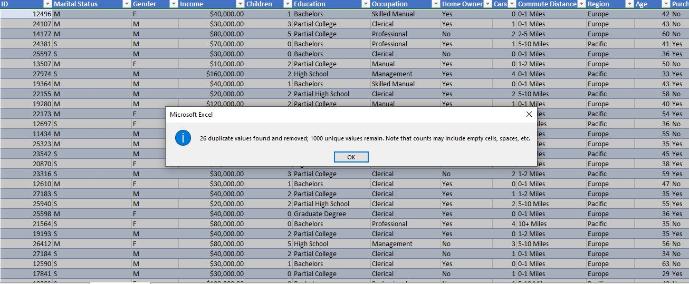

# Bike-Purchase-Insights-Navigating-Trends-and-Territories

## Introduction
Leveraging the dataset's insight into bike purchase patterns, we aim to uncover the distinctive purchasing power dynamics across Europe, North America, and the Pacific. Understanding how regional influences intersect with individual choices provides a nuanced perspective on the factors steering bike ownership decisions in diverse geographical contexts.

## Objective 
The objective of this case study is to analyze a dataset containing information on individuals, including their demographics, socioeconomic status, and purchasing behavior related to bikes. The primary goal is to uncover patterns and insights that can help us understand the factors influencing the decision to purchase a bike.

## Problem Statement
Within this dataset, sourced directly from the heart of Europe, North America, and the Pacific. retail landscape, we aim to uncover the patterns and intricacies that influence customers' decisions to purchase bikes. Our focus is on understanding the diverse demographic and behavioral factors shaping these choices.

## Variables
### There are several variables in the dataset that will have an impact on the outcome of the analysis
 
•	ID

•	Marital Status

•	Gender

•	Income

•	Children

•	Education

•	Occupation

•	Homeowner

•	Cars

•	Commute Distance

•	Region

•	Age

•	Purchased Bike (Target variable)

 

## Data Source
Leveraging data from local stores across Europe, North America, and the Pacific, I employ meticulous transformation and advanced analytics to unveil impactful insights. Through dynamic visualizations, we craft a narrative that illuminates the compelling stories hidden within this diverse dataset. #DataDrivenNarratives #GlobalInsights 

## Data Cleaning
Check for missing values, outliers, and inconsistencies in the data. Clean the dataset to ensure accurate and reliable analysis.

## Removing duplicates
In the data preparation phase, duplicate entries were systematically removed from the dataset by utilizing Excel's "Remove Duplicates" functionality. This process, carried out on a specific range of cells, ensures the accuracy and reliability of subsequent analyses. The cleaned dataset was then saved, documenting the procedure for future reference and maintaining data integrity throughout the project.

 
During data refinement, Excel's "Find & Replace" efficiently replaced values, converting 'S' to 'Single' and 'M' to 'Married' in one row, and 'F' to 'Female' and 'M' to 'Male' in another. After entering replacements, changes were reviewed for accuracy, and the updated dataset was saved for seamless integration into the project.

 

I make use of the if function to insect the Age range into different Categories for example from 0-36 is Adult,36-50 is Middle Age and 50- 90 is Old using this function below
=IF([@Age]<36,"Adult",IF([@Age]< 50,"Middle Age",IF([@Age]<90,"Old")))

 

## Analysis and Insights:
### Predictive Modeling:
Build a predictive model to determine the likelihood of an individual purchasing a bike. Utilize Dashboard to show case their behavior.
### Segmentation Analysis:
Segment the dataset based on demographics (age, gender, income, education) and analyze the distinct characteristics of each segment. Are there specific groups with a higher propensity to purchase bikes?
### Correlation Analysis:
Investigate the relationships between variables. Explore correlations between income, education, commute distance, and the likelihood of purchasing a bike.

## Key Questions:

**1.	Does income significantly influence the decision to purchase a bike?**  [Chart link](https://1drv.ms/x/c/da5a321cf3501179/IQMGGEryoTTiS7yMIFsc7IbcAUcQjRMw92oxN7hp9VRCcPE?)

  
  
In the given Chart, the Professional category stands out with the highest total income among bike purchasers, amounting to $11,290,000. Conversely, the Manual category exhibits the lowest total income for those who bought bikes, totaling $940,000. Analyzing these extremes provides valuable insights into the income differentials influencing bike purchasing decisions.

**2.	Are there demographic segments that show a higher affinity for bike purchases?** [Chart link](https://1drv.ms/x/c/da5a321cf3501179/IQMGGEryoTTiS7yMIFsc7IbcAUcQjRMw92oxN7hp9VRCcPE?)

               

•	The data reveals a nearly equal distribution in bike purchases between females (49.69%) and males (50.31%). There isn't a substantial gender-based difference in the affinity for bike purchases, indicating a balanced interest across demographic segments.

•	Single individuals slightly lead in bike purchases, constituting 51.98%, while married individuals account for 48.02%. The marginal difference suggests a relatively balanced affinity for bike purchases across marital status segments.

**3.	How does homeownership and commute distance impact the likelihood of buying a bike?** [Chart link](https://1drv.ms/x/c/da5a321cf3501179/IQMGGEryoTTiS7yMIFsc7IbcAUcQjRMw92oxN7hp9VRCcPE?)

 
Individuals with commute distances of 0-5 miles show a higher affinity for bike purchases, particularly in the 0-1 mile, 1-2 miles, and 2-5 miles segments. Shorter commute distances appear to be associated with an increased likelihood of bike purchases.

**4.	Is there a correlation between the number of cars owned and the decision to purchase a bike?** [Chart link](https://1drv.ms/x/c/da5a321cf3501179/IQMGGEryoTTiS7yMIFsc7IbcAUcQjRMw92oxN7hp9VRCcPE?)

 
In this Chart, we see a clear trend: the fewer cars someone owns, the more likely they are to purchase a bike. Notably, 151 out of 247 individuals with zero cars opted for a bike, suggesting a potential marketing focus on car-free demographics for increased bike sales.

**5.	Are regional differences apparent in bike purchasing behavior?** [Chart link](https://1drv.ms/x/c/da5a321cf3501179/IQMGGEryoTTiS7yMIFsc7IbcAUcQjRMw92oxN7hp9VRCcPE?)

 

•	Regional differences in bike purchasing behavior are evident in the data, with North America showing the highest percentage of bike purchases at 50.80%. Europe follows at 30.00%, while the Pacific region has a lower percentage of 19.20%.

•	This pivot table reveals notable regional variations in bike purchasing behavior. North America leads in bike purchases with 220, followed by Europe (148) and the Pacific (113), suggesting distinct regional preferences in bike ownership.

Join us in the exciting venture of designing a cutting-edge dashboard to track and analyze purchasing power trends. With sleek visuals and real-time updates, our dashboard transforms raw data into actionable insights, offering a comprehensive view of the ever-evolving landscape of purchasing dynamics. Together, let's navigate the journey of informed decision-making in the realm of purchasing power analysis [Dashboard link](https://1drv.ms/x/c/da5a321cf3501179/IQMGGEryoTTiS7yMIFsc7IbcAUcQjRMw92oxN7hp9VRCcPE?)

 

## Conclusion:
After carefully cleaning up the data from local stores, we've discovered interesting things. For instance, people with shorter commutes seem keener on bikes. Also, when it comes to cars, fewer cars often mean more bike purchases.

The charts told us a lot. In North America, half the folks are into bikes, while Europe and the Pacific have their own styles. For example, in Europe, it's around 30%, and in the Pacific, it's a bit less, about 19%.

Knowing all this helps us plan better. If we're selling bikes, focusing on regions where they're more popular is a smart move. Also, targeting folks with shorter commutes or fewer cars might just boost our sales.

Different regions, different choices. Whether it's influenced by how far they travel or how many cars they own, we've got the insights to tailor our strategies. It's not just about selling bikes; it's about understanding why people buy them. And that's the key to our success.

 

